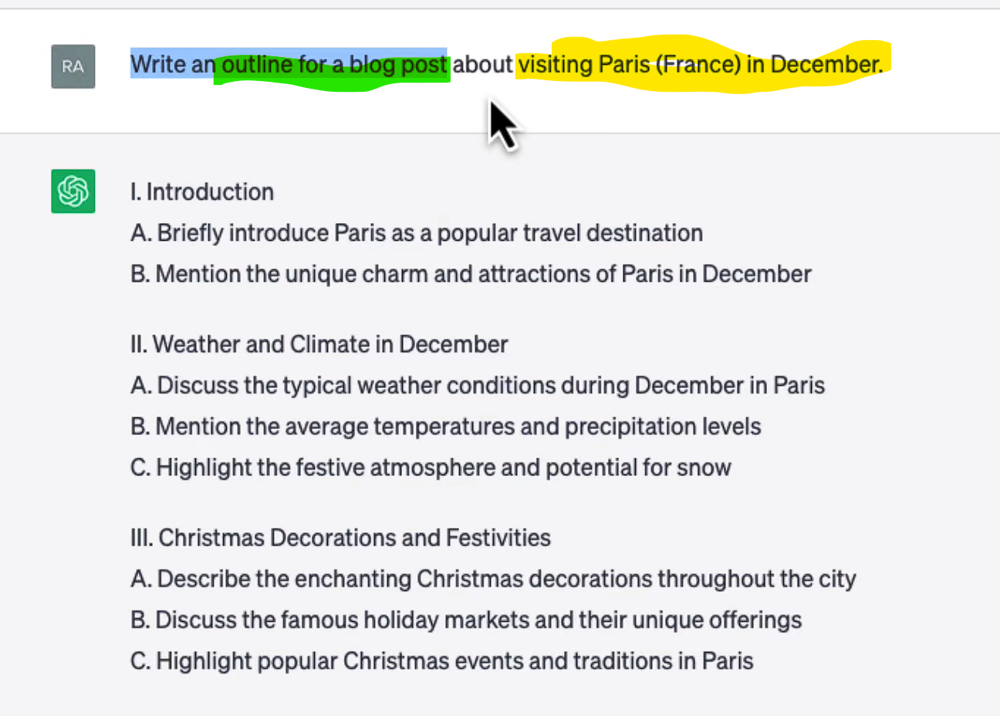

https://www.youtube.com/watch?v=L8l4mwVV2lY

Chúng ta chú ý rằng, câu chúng ta đưa vào CHAT-GPT có thể vừa là input vừa là prompt.

- "Classify this news article" chính là prompt của chúng ta.
- "Article" có thể là đường link đến bài báo nào đó. Đây là input của chúng ta.
- "sport" và "politic" chính là các nhãn có thể có.

- "Classify this sentence" chính là prompt của chúng ta.
- "{Sentence}" có thể là đường link đến bài báo nào đó. Đây là input của chúng ta.
- "English" và "French" chính là các nhãn có thể có.
<!-- Tổng kết -->
- Prompt nên dễ hiểu và rõ ràng.
- Prompt có thể cho chính chúng ta tạo ra mà không cần dựa trên trích xuất dữ liệu.
<!-- One-shot -->

- Bao gồm:
    - Task: "Create a list of ten book ...".
    - Input: Không có.
    - Output: "ten books".
    - Context: Non
<!-- Zero-shot -->

- Bao gồm:
    - Task: "Convert ... a table".
    - Input: "output".
    - Output: "Column 1 ...".
    - Context: Non
<!-- Role -->

- Bao gồm:
    - Task: "Act as a Mac terminal".
    - Input: "curl w ...".
    - Output: "Output shuold be ... blocks".
    - Context: Cả hai cái prompt được xem như là context của câu tương lai.
    - Role prompt: "curl ... greenhorne" và " rewrite the previous ... Vader".
<!-- Few-shot -->
Thường được sử dụng cho boojd ữ liệu lớn

- Bao gồm:
    - Task: Blue.
    - Input: Yellow.
    - Output: Green.
    - Context: Red.
<!-- Chain -->

- Bao gồm:
    - Task: Blue.
    - Input: Yellow.
    - Output: Green.
    - Context: Non.